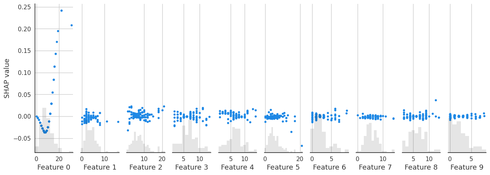

PyRBP basic usage flow
=================================
This example illustrates the basic usage of ``PyRBP``, including loading the dataset, generating features, feature selection, training the model, and performance and feature analysis.

This example uses:

- ``PyRBP.filesOperation``
- ``PyRBP.Features``
- ``PyRBP.evaluateClassifiers``
- ``PyRBP.metricsPlot``
- ``PyRBP.featureSelection``

.. code-block:: py

    from PyRBP.filesOperation import read_fasta_file, read_label
    from PyRBP.Features import generateDynamicLMFeatures, generateStaticLMFeatures, generateStructureFeatures, generateBPFeatures
    from PyRBP.evaluateClassifiers import evaluateDLclassifers
    from PyRBP.metricsPlot import violinplot, shap_interaction_scatter
    from PyRBP.featureSelection import cife
    from sklearn.svm import SVC

Load the dataset
~~~~~~~~~~~~~~~~~~~~~~~~~~~~~~~~~
Load a AGO1 dataset as example.

.. code-block:: py

    # Define the path where the dataset locates.
    fasta_path = '/home/wangyansong/PyRBP/src/RNA_datasets/circRNAdataset/AGO1/seq'
    label_path = '/home/wangyansong/PyRBP/src/RNA_datasets/circRNAdataset/AGO1/label'

    sequences = read_fasta_file(fasta_path)  # Read sequences and labels from given path
    label = read_label(label_path)

Generate features for sequences
~~~~~~~~~~~~~~~~~~~~~~~~~~~~~~~~~~~~~
We generate three types of features as examples, in generating biological features, we generate Positional gapped k-m-tuple pairs (PGKM) features, in generating semantic information, we process the sequence as 4mer in dynamic model, while in static model, we process the sequence as 3mer and use fasttext as the model for embedding extraction.

.. code-block:: py

    biological_features = generateBPFeatures(sequences, PGKM=True)  # generate biological features
    bert_features = generateDynamicLMFeatures(sequences, kmer=4, model='/home/wangyansong/PyRBP/src/RBP_apckage_no_banana/dynamicRNALM/circleRNA/pytorch_model_4mer')  # generate dynamic semantic information
    static_features = generateStaticLMFeatures(sequences, kmer=3, model='/home/wangyansong/PyRBP/src/RBP_apckage_no_ban2ana/staticRNALM/circleRNA/circRNA_3mer_fasttext') # static semantic information
    structure_features = generateStructureFeatures(fasta_path, script_path='/home/wangyansong/PyRBP_test/src/PyRBP/RNAplfold', basic_path='/home/wangyansong/PyRBP_test/src/circRNAdatasetAGO1', W=101, L=70, u=1)  # generate secondary structure information

Perform feature selection to refine the biological features
~~~~~~~~~~~~~~~~~~~~~~~~~~~~~~~~~~~~~~~~~~~~~~~~~~~~~~~~~~~~~~~~~~
We take the cife method as example.

.. code-block:: py

    print(biological_features.shape)
    refined_biological_features = cife(biological_features, label, num_features=10)  # refine the biologcial_feature using cife feature selection method
    print(refined_biological_features.shape)

The output of the above code is as follows:

    ::

        (34636, 400)
        (34636, 10)

Evaluate deep/machine learning classifier
~~~~~~~~~~~~~~~~~~~~~~~~~~~~~~~~~~~~~~~~~~~~
We take the deep learning models as example.

.. code-block:: py

    evaluateDLclassifers(bert_features, folds=10, labels=label, file_path='./', shuffle=True) # 10-fold cross-validation of deep learning models using dynamic semantic information

After the function finishes running, a ``DL_evalution_metrics.csv`` will be saved in the path specified by ``file_path``, with the following format.

    ::

        clf_name,metrics,metric_name
        CNN,0.999745345,AUC
        CNN,0.995525096	ACC
        CNN,0.991053703,MCC
        CNN,0.994975596,Recall
        CNN,0.9955248,F1_Scores
        RNN,0.998232352,AUC
        RNN,0.988452081,ACC
        RNN,0.976941921,MCC
        RNN,0.983881982,Recall
        RNN,0.988370228,F1_Scores
        ResNet,0.999630465,AUC
        ResNet,0.995900484,ACC
        ResNet,0.991807785,MCC
        ResNet,0.994295177,Recall
        ResNet,0.995894144,F1_Scores
        MLP,0.988894799,AUC
        MLP,0.935463968,ACC
        MLP,0.867734521,MCC
        MLP,0.978133195,Recall
        MLP,0.951769181,F1_Scores

Visualize performance and feature analysis
~~~~~~~~~~~~~~~~~~~~~~~~~~~~~~~~~~~~~~~~~~~~~~~~~~~
We use the SVM trained with refined_biological_features for feature shap value calculation as an example.

.. code-block:: py

    clf = SVC(probability=True)
    shap_interaction_scatter(refined_biological_features, label, clf=clf, sample_size=(0, 100), feature_size=(0, 10), image_path='./')  # Plotting the interaction between biological features in SVM

An ``interaction_scatter.png`` will be saved under ``file_path``, as follows.

