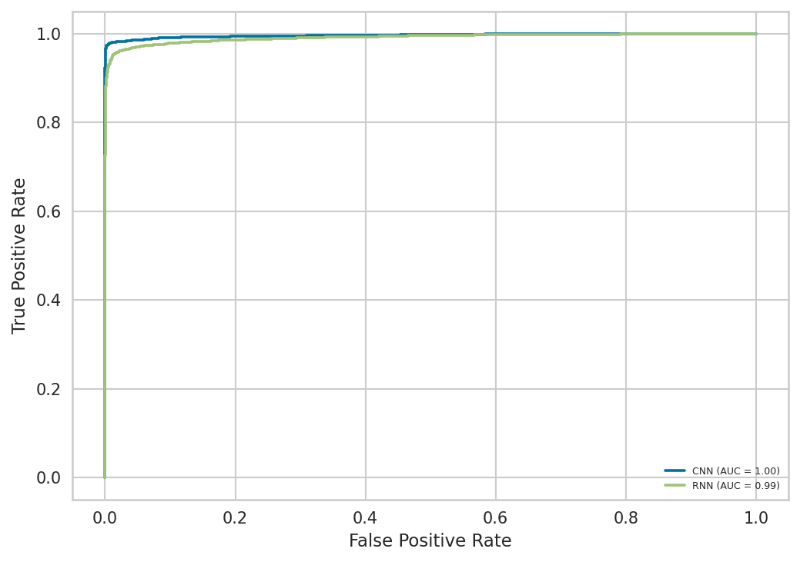
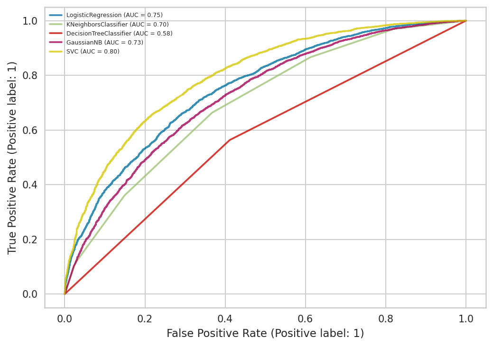
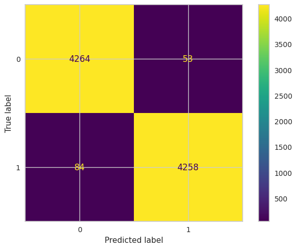
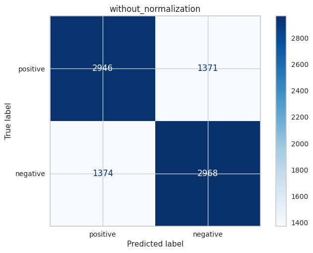
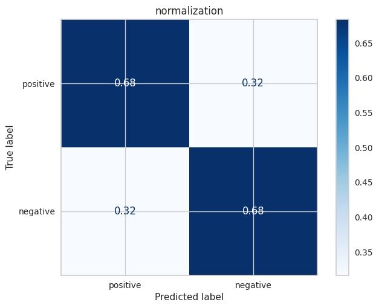
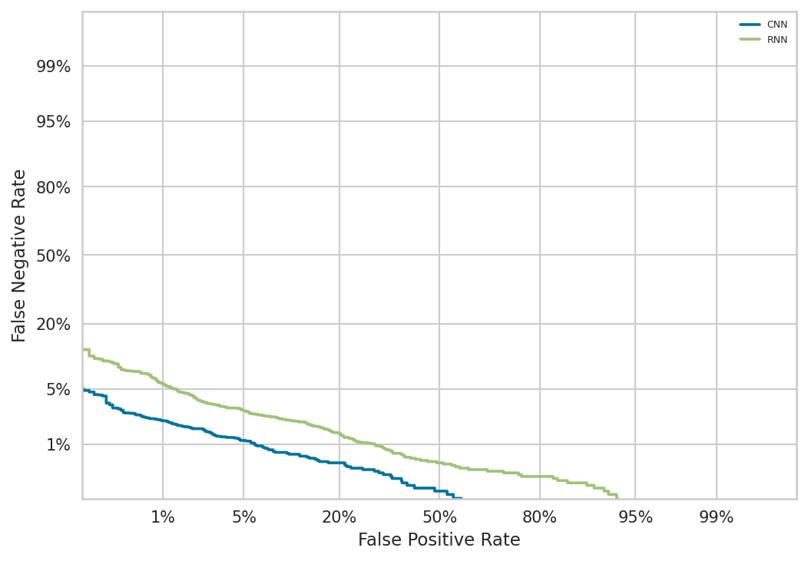
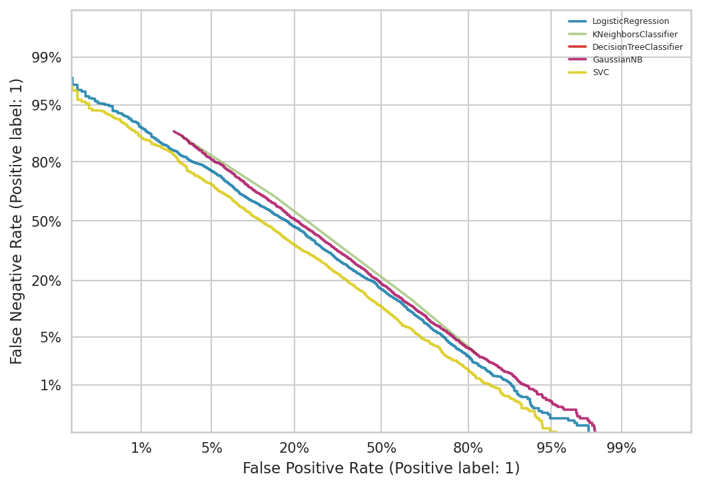
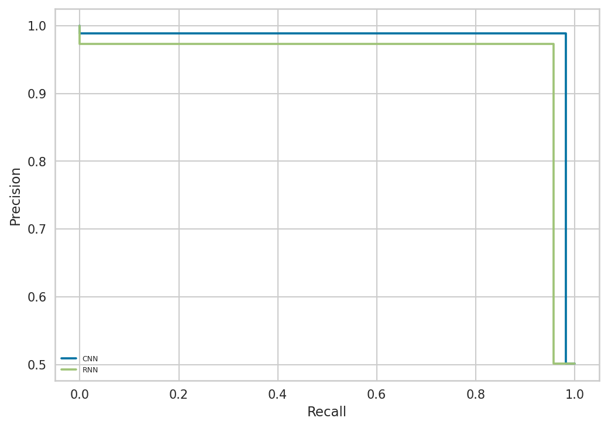
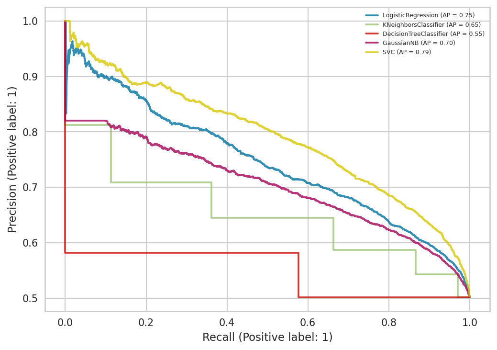

Performance and data visualization examples
==================================================

A variety of visualization functions are integrated in RBP_package, which can perform certain correlation analysis on feature data and also visualize the obtained performance index data for plotting.

Importing related modules
~~~~~~~~~~~~~~~~~~~~~~~~~~~~~~~~~~~~~~~

.. code-block:: py

    # import file operation module
    from RBP_package.filesOperation import *

    # import the visualize module in RBP_package
    from RBP_package.metricsPlot import *

    # create CNN and RNN models for example
    from RBP_package.evaluateClassifiers import createRNN, createCNN
    from RBP_package.Features import generateDynamicLMFeatures, generateBPFeatures

    # import some machine learning classifiers for example
    from sklearn.linear_model import LogisticRegression
    from sklearn.neighbors import KNeighborsClassifier
    from sklearn.tree import DecisionTreeClassifier
    from sklearn.svm import SVC
    from sklearn.naive_bayes import GaussianNB

    # import train_test_split module to divide features into training set and test set.
    from sklearn.model_selection import train_test_split
    
    from tensorflow.keras.callbacks import EarlyStopping
    from tensorflow.keras.utils import to_categorical

Data preparation
~~~~~~~~~~~~~~~~~~~~~~~~~~~~~~~~~~~~~~~

Here we prepare the relevant features as well as models to be used in different plot functions.

.. code-block::

    fasta_path = '/home/wangyansong/RBP_package/src/RBP_apckage_no_banana/RNA_datasets/circRNAdataset/AGO1/seq'
    label_path = '/home/wangyansong/RBP_package/src/RBP_apckage_no_banana/RNA_datasets/circRNAdataset/AGO1/label'

    sequences = read_fasta_file(fasta_path)  # read sequences and labels from given path
    label = read_label(label_path)

    # Generate dynamic semantic information for training deep learning models
    dynamic_semantic_information = generateDynamicLMFeatures(sequences, kmer=4, model='/home/wangyansong/RBP_package/src/RBP_apckage_no_banana/dynamicRNALM/circleRNA/pytorch_model_4mer')

    # Generate biological features for training machine learning classifiers
    biological_features = generateBPFeatures(sequences, PGKM=True)

    # create CNN and RNN models for plots.
    CNN_model = createCNN(dynamic_semantic_information.shape[1], dynamic_semantic_information.shape[2])
    RNN_model = createRNN(dynamic_semantic_information.shape[1], dynamic_semantic_information.shape[2])

    # create several machine learning classifiers for plots.
    ML_Classifiers = [
        LogisticRegression(max_iter=10000),
        KNeighborsClassifier(),
        DecisionTreeClassifier(),
        GaussianNB(),
        SVC(probability=True)
    ]

    callbacks = [EarlyStopping(monitor='val_loss', patience=5, verbose=2, mode='min', restore_best_weights=True)]
    labels_2D = to_categorical(label)

Plot roc curve
~~~~~~~~~~~~~~~~~~~~~~~~~~~

This example shows how to use the ``RBP_package.metricsPlot`` module to plot the roc curve.

Deep learning models
------------------------

.. code-block:: py

    label_list = []
    pred_proba_list = []
    name_list = ['CNN', 'RNN']

    # Divide the features into training and test sets in the ratio of 3:1
    X_train, test_X, y_train, test_y = train_test_split(dynamic_semantic_information, labels_2D, test_size=0.25, random_state=6)

    # Take 10% from the training set as the validation set
    train_X, val_X, train_y, val_y = train_test_split(X_train, y_train, test_size=0.1, random_state=6)

    # train CNN and RNN models
    CNN_model.compile(optimizer='adam', loss='binary_crossentropy', metrics=['accuracy'])
    CNN_model.fit(x=train_X, y=train_y, epochs=30, batch_size=64, verbose=0, shuffle=True, callbacks=callbacks,
                          validation_data=(val_X, val_y))
    pre_proba_CNN = CNN_model.predict(test_X)[:, 1]
    test_y1 = test_y[:, 1]
    label_list.append(test_y1)
    pred_proba_list.append(pre_proba_CNN)

    RNN_model.compile(optimizer='adam', loss='binary_crossentropy', metrics=['accuracy'])
    RNN_model.fit(x=train_X, y=train_y, epochs=30, batch_size=64, verbose=0, shuffle=True, callbacks=callbacks,
                          validation_data=(val_X, val_y))
    pre_proba_RNN = RNN_model.predict(test_X)[:, 1]
    test_y2 = test_y[:, 1]
    label_list.append(test_y2)
    pred_proba_list.append(pre_proba_RNN)

    # plot the roc curve
    roc_curve_deeplearning(label_list=label_list, pred_proba_list=pred_proba_list, name_list=name_list, image_path='./')

After the function finishes running, it will save a ``roc_curve.png`` file in the path specified by ``image_path``, as follows:

Machine learning classifiers
---------------------------------

In the machine learning plotting process, we don't need to train the classifiers manually, we just need to pass the feature matrix, labels and classifiers into the function.

.. code-block:: py

    # Using the previously created set of classifiers and the biological feature matrix, the test set ratio is set to 0.25 for roc curve plotting.
    roc_curve_machinelearning(biological_features, label, ML_Classifiers, image_path='./', test_size=0.25, random_state=6)

After the function finishes running, it will save a ``roc_curve.png`` file in the path specified by ``image_path``, as follows:

Plot confusion matrix
~~~~~~~~~~~~~~~~~~~~~~~~~~~

This example shows how to use the ``RBP_package.metricsPlot`` module to plot the confusion matrix.

Deep learning models
------------------------

.. code-block:: py

    # Divide the features into training and test sets in the ratio of 3:1
    X_train, test_X, y_train, test_y = train_test_split(dynamic_semantic_information, label, test_size=0.25, random_state=6)

    # Take 10% from the training set as the validation set
    train_X, val_X, train_y, val_y = train_test_split(X_train, y_train, test_size=0.1, random_state=6)

    # train CNN model for example
    CNN_model.compile(optimizer='adam', loss='binary_crossentropy', metrics=['accuracy'])
    CNN_model.fit(x=train_X, y=train_y, epochs=30, batch_size=64, verbose=0, shuffle=True, callbacks=callbacks,
                          validation_data=(val_X, val_y))
    pre_proba_CNN = CNN_model.predict(test_X)
    pred_labels = np.argmax(pre_proba_CNN, axis=1)
    test_labels = test_y[:, 1]

    # plot the confusion matrix
    confusion_matirx_deeplearning(test_labels=test_labels, pred_labels=pred_labels, image_path='./')

After the function finishes running, it will save a ``confusion_matrix.png`` file in the path specified by ``image_path``, as follows:

Machine learning classifiers
--------------------------------

.. code-block:: py
    
    # select the LogisticRegression for example
    clf = ML_Classifiers[0]

    # the test set ratio is set to 0.25 for plotting confusion matrix
    confusion_matrix_machinelearning(clf, biologcial_feature, label, test_size=0.25, normalize=None, random_state=6, image_path='./')

After the function finishes running, it will save a ``without_normalization_confusionMatrix.png`` file in the path specified by ``image_path``, as follows:

When ``normalize`` is set to 'true', 'pred' or 'all', the resulting image is as follows (file name is ``normalization_confusionMatrix.png``):

Plot det curve
~~~~~~~~~~~~~~~~~~~~~~~~~~~

This example shows how to use the ``RBP_package.metricsPlot`` module to plot the det curve.

Deep learning models
------------------------

.. code-block:: py

    label_list = []
    pred_proba_list = []
    name_list = ['CNN', 'RNN']

    # Divide the features into training and test sets in the ratio of 3:1
    X_train, test_X, y_train, test_y = train_test_split(dynamic_semantic_information, labels_2D, test_size=0.25, random_state=6)

    # Take 10% from the training set as the validation set
    train_X, val_X, train_y, val_y = train_test_split(X_train, y_train, test_size=0.1, random_state=6)

    # train CNN and RNN models
    CNN_model.compile(optimizer='adam', loss='binary_crossentropy', metrics=['accuracy'])
    CNN_model.fit(x=train_X, y=train_y, epochs=30, batch_size=64, verbose=0, shuffle=True, callbacks=callbacks,
                          validation_data=(val_X, val_y))
    pre_proba_CNN = CNN_model.predict(test_X)[:, 1]
    test_y1 = test_y[:, 1]
    label_list.append(test_y1)
    pred_proba_list.append(pre_proba_CNN)

    RNN_model.compile(optimizer='adam', loss='binary_crossentropy', metrics=['accuracy'])
    RNN_model.fit(x=train_X, y=train_y, epochs=30, batch_size=64, verbose=0, shuffle=True, callbacks=callbacks,
                          validation_data=(val_X, val_y))
    pre_proba_RNN = RNN_model.predict(test_X)[:, 1]
    test_y2 = test_y[:, 1]
    label_list.append(test_y2)
    pred_proba_list.append(pre_proba_RNN)

    # plot the det curve
    det_curve_deeplearning(label_list, pred_proba_list, name_list, image_path='./')

After the function finishes running, it will save a ``det_curve.png`` file in the path specified by ``image_path``, as follows:

Machine learning classifiers
-------------------------------

In the machine learning plotting process, we don't need to train the classifiers manually, we just need to pass the feature matrix, labels and classifiers into the function.

.. code-block:: py

    det_curve_machinelearning(biological_features, label, ML_Classifiers, image_path='./', test_size=0.25, random_state=6)

After the function finishes running, it will save a ``det_curve.png`` file in the path specified by ``image_path``, as follows:

Plot precision recall curve
~~~~~~~~~~~~~~~~~~~~~~~~~~~

This example shows how to use the ``RBP_package.metricsPlot`` module to plot the precision recall curve.

Deep learning models
------------------------

.. code-block:: py

    label_list = []
    pred_label_list = []
    name_list = ['CNN', 'RNN']

    # Divide the features into training and test sets in the ratio of 3:1
    X_train, test_X, y_train, test_y = train_test_split(dynamic_semantic_information, labels_2D, test_size=0.25, random_state=6)

    # Take 10% from the training set as the validation set
    train_X, val_X, train_y, val_y = train_test_split(X_train, y_train, test_size=0.1, random_state=6)

    # train CNN and RNN models
    CNN_model.compile(optimizer='adam', loss='binary_crossentropy', metrics=['accuracy'])
    CNN_model.fit(x=train_X, y=train_y, epochs=30, batch_size=64, verbose=0, shuffle=True, callbacks=callbacks,
                          validation_data=(val_X, val_y))
    pre_proba_CNN = CNN_model.predict(test_X)
    test_y1 = test_y[:, 1]
    label_list.append(test_y1)
    pred_label_list.append(np.argmax(pre_proba_CNN, axis=1))

    RNN_model.compile(optimizer='adam', loss='binary_crossentropy', metrics=['accuracy'])
    RNN_model.fit(x=train_X, y=train_y, epochs=30, batch_size=64, verbose=0, shuffle=True, callbacks=callbacks,
                          validation_data=(val_X, val_y))
    pre_proba_RNN = RNN_model.predict(test_X)
    test_y2 = test_y[:, 1]
    label_list.append(test_y2)
    pred_label_list.append(np.argmax(pre_proba_RNN, axis=1))

    # plot the precision recall curve
    precision_recall_curve_deeplearning(label_list, pred_label_list, name_list, image_path='./')

After the function finishes running, it will save a ``precision_recall_curve.png`` file in the path specified by ``image_path``, as follows:

Machine learning models
--------------------------

.. code-block:: py

    precision_recall_curve_machinelearning(biological_features, label, ML_Classifiers, image_path='./', test_size=0.25, random_state=6)

After the function finishes running, it will save a ``precision_recall_curve.png`` file in the path specified by ``image_path``, as follows:

